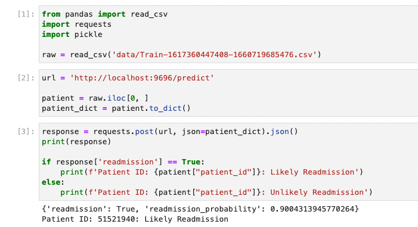

# ML Zoomcamp Midterm

## Problem Description
* Patient readmission is an issue in hospitals, both in terms of patient care and hospital costs.
* Accurately predicting readmissions would be a useful tool in order to pre-emptively ensure appropriate measures are taken in order to ensure a patient's well-being.
* The data modeled contains stats on patients' hospital stays and whether or not they were readmitted.
* The project is to attempt to create a useful model predicting patient readmission

## How to run the project
1. Ensure docker is installed
2. In this directory, build the image: `docker build -t midterm:latest .`
3. Run a container based on this image: `docker run -it --rm -p 9696:9696 midterm`
    * This will create a small flask webapp which will return a prediction based on a paitent's info.
4. You can test it yourself, or open up `test_predict.ipynb` in order to test varioius patients from the test training set (not used in the modeling).

## Data
* all data in the `data/` directory
* `Train-1617360447408-1660719685476.csv` was used for modeling and testing
* `test-1617360461595-1660719701431.csv` can be used to get data for testing the web-app

## Notebook
* All work is done in the `Midterm.ipynb` notebook.
* Sections are labeled appropriately (data prep, EDA, modeling + parameter tuning, model selection)

## Training Final Model
* This can be found in `train.py`
* It writes the model (and an additional function, `DMatrix`) to `model_midterm.bin`

## Web App
* We load the model and seve the webapp with  `predict.py`
* Note we also use a file which contains some helpers, `train_helpers.py`

## Dependencies
* `Pipenv` and `Pipenv.lock` are included in the repository directory

## Containerization
* A `Dockerfile` is included in the repository directory

## Deployment
* I was unable to host it using Google App Engine, :(
* I've included a picture of me using `test_predict.ipynb` and getting a succesfful response:

